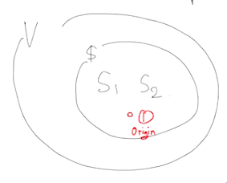

  
# 1. Vector space

 

## 1.1 정의

어떤 집합 $V$이 Vector space를 만족하려면, 다음과 같은 두가지 성질을 만족해야한다.(두 성질에 닫혀 있어야한다.(closed)) 

1. for any vetors $x,y \; \in R^n$,   
    $x,y\; \in V$ -> $x+y \; \in V$
2. for any scalar $c\;in R $,  
    $cx,cy\; \in V$

두 조건을 합치면 다음과 같이 하나로 만들 수 있다. 

$$
c_1x+c_2y \; \in\; V\;\; (\forall x,y\;\in\;V,\;\forall c_1,c_2\;\in\;R)
$$

위 조건을 만족해야 우리는 해당 집합 $V$를 **Vector space**라고 부를 수 있다.

**Vector space**는 항상 origin을 갖고 있는 것도 잊지 말자.

   

# 2. Subspace

 

## 2.1 정의
전체 Vector space $V$의 subset $S$가 여전히 Vector space의 조건을 만족한다면, 
이것을 Subspace라고 부른다. 즉, $s_1,s_2$가 $S$의 원소일 때, $c_1s_1+c_2s_2 \; \in\; S\;\; (\forall s_1,s_2\;\in\;S\subset V,\;\forall c_1,c_2\;\in\;R)$
를 만족하면 되는 것이다.

항상 Origin은 모든 Vector space에 속하며 동시에 모든 Subspace에 속함을 잊지말자.
