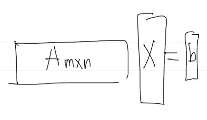

  
# Null space

## 정의
Null space는 다음의 조건을 만족하는 벡터들의 집합이다.

$$
N(A) = \{x|Ax=\textbf{0}\}
$$

## Null space 구하기
다음과 같은 형태의 $Ax=b=\textbf{0}$ 가 있다고 하자.

이 때, $ number \;of\;equations < number \;of\;unknowns $ 이다. 

### Row Reduced Echelon form R
다음과 같은 예제가 있다고 하자.

$$
\begin{bmatrix}
1&3&3&2\\
2&6&9&7\\
-1&-3&3&4
\end{bmatrix}
\begin{bmatrix}
u\\v\\w\\z
\end{bmatrix}=\begin{bmatrix}
0\\0\\0
\end{bmatrix}
$$
이 때, Column space $C(A)\in R^m$, Null space$N(A)\in R^n$이다.

이제 Gaussian elimination을 통해 Upper triangular 꼴로 만들고 pivot을 1로 만들어주면 다음과 같이 Row Reduced form $R$을
얻을 수 있다.
$$
R=\begin{bmatrix}
1&3&0&-1\\
0&0&1&1\\
0&0&0&0
\end{bmatrix}
$$

영행렬은 이 과정에서 영행렬이기 때문에 영향을 받지 않는다. 

### Null space 직접 구하기
식을 다시 쓰면, 다음과 같다.

$$
Rx=\begin{bmatrix}
1&3&0&-1\\
0&0&1&1\\
0&0&0&0
\end{bmatrix}
\begin{bmatrix}
u\\v\\w\\z
\end{bmatrix}=\begin{bmatrix}
0\\0\\0
\end{bmatrix}
$$

이 때, pivot이 1인 것과 관계를 맺는 variables $u,w$를 **pivot variable** 이라고 하고, 아닌 것들을 **free variable**이라고 한다.

우리가 해야할 것은 **pivot variable**을 **free variable**로 표현하는 것이다.

$$\begin{aligned}
u&=-3v+z \\
w&=-z
\end{aligned}
$$

따라서 $x$를 다음과 같이 정의할 수 있다.

$$
x=\begin{bmatrix}
u\\v\\w\\z
\end{bmatrix}=\begin{bmatrix}
-3v+z\\v\\-z\\z
\end{bmatrix}
= v\begin{bmatrix}
-3\\1\\0\\0
\end{bmatrix}+z\begin{bmatrix}
1\\0\\-1\\1
\end{bmatrix} \in N(A)
$$

이때 두 벡터 $\begin{bmatrix}
-3 &1&0&0
\end{bmatrix}$와 $\begin{bmatrix}
1&0&-1&1
\end{bmatrix} $ 를 **Special solution** 이라고 한다.

따라서 Null space $N(A)$는 이 예제에선 다음과 같이 정의될 것이다.

$$
N(A)=\{ \begin{bmatrix}
u\\v\\w\\z
\end{bmatrix} | c_1\begin{bmatrix}
-3\\1\\0\\0
\end{bmatrix}+c_2\begin{bmatrix}
1\\0\\-1\\1
\end{bmatrix}\, ,\;for\;any\;c_1,c_2\}
$$

## Null space의 dimension

Null space의 dimension은 독립적인 **Special solution**의 수를 뜻한다. (Null space가 Special solution들로 span되는 것이기 때문에 너무나도 당연한 이야기이다.)
위 예제를 빌려오면, $Dim(N(A))=2$이다. 

그런데 $x$는 4차원이었다. 남은 2차원은 어디갔을까? 이것은 Row space로 간다고 한다. 그래서 Null space와 Row space는 서로 
상호 보완적이라고 한다. 그럼 Column space와 상호 보완적인 Space는 무엇일까? 그것은 나중에 배울 Left Null space $N(A^T)$라고 한다.
